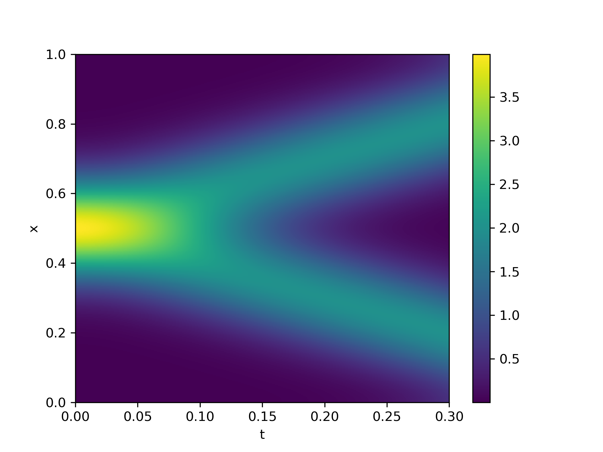

# ScalarWaveEquation

## Homework 2 for PHYS 776

A collection of functions that use the method of liens to solve the scalar wave equation in 1 + 1 dimensions. Differentiation is done using the central difference method. Integration is done using the second order forward Euler method.

## Instructions

The *x*-axis is discretized using *N* points on [0, 1]. Let *x*<sub>*i*</sub> = (*i* - 1)/(*N* - 1). The user must provide (1) the total number of time steps *N*<sub>*t*</sub>, (2) the total duration of time *T*<sub>*tot*</sub>, (3) the initial positions and (4) initial velocities *u*(*x*<sub>*i*</sub>, t = 0) and *u*<sub>*t*</sub>(*x*<sub>*i*</sub>, t = 0) in the form of 1D Arrays. An example is provided in `src/example1.jl`.

## Example

```Julia
using ScalarWaveEquation
using PyPlot

function get_gaussian(N::Int)
	# returns a normalized Gaussian distribution with (mean, std) = (0.5, 0.1)
	mean = 0.5
	std  = 0.1
	
	xdata      = range(0.0, stop = 1.0, length = N)
	exponent   = -0.5 * (xdata.-mean) .* (xdata.-mean) / (std*std)
	norm_coeff = std*sqrt(2*pi)
	
	return exp.(exponent)/norm_coeff
end

Ttot = 0.3   # total duration
Nt   = 1000  # number of time divisions
Nx   = 400   # number of divisions on position axis

# initial conditions are accepted in the form of FunArr instances
# we create them from 1D Arrays, discretized on [0, 1]
init_positions  = get_gaussian(Nx)
init_velocities = zeros(Nx)
ufun  = FunArr{Float64, Float64}(init_positions)
utfun = FunArr{Float64, Float64}(init_velocities)

# use the method of lines to calculate u(x, t) over [0, 1]x[0, Ttot]
# returns (1) a FunArr2D instance with the 2D Array
#         (2) the energy at each of the Nt time steps
u2fun, energies = scalarwave_and_energy(ufun, utfun, Nt, Ttot)
```



The convergence of the solution as a function of the grid resolution can be found using `integrate_difference` to compare two solutions at different resolutions. More details are given in `src/example2.jl`.

```Julia
function get_gaussian_solution(Nx::Int, Nt::Int, Ttot::T) where {T}
	# returns a FunArr2D instance for the solution to the gaussian
	ufun  = FunArr{Float64, Float64}(get_gaussian(Nx))
	utfun = FunArr{Float64, Float64}(zeros(Nx))
	
	u2fun, energies = scalarwave_and_energy(ufun, utfun, Nt, Ttot)
	return u2fun
end

# get the solution at different resolutions for the same duration
u2fun1 = get_gaussian_solution(100, 150, 0.2)
u2fun2 = get_gaussian_solution(200, 300, 0.2)
u2fun3 = get_gaussian_solution(300, 450, 0.2)
u2fun4 = get_gaussian_solution(400, 600, 0.2)

# get the integrated squared difference between solutions
area12 = integrate_difference(u2fun1, u2fun2, 2000, 2000)
area23 = integrate_difference(u2fun2, u2fun3, 2000, 2000)
area34 = integrate_difference(u2fun3, u2fun4, 2000, 2000)

# the differences between increasing resolutions decreases
println("The integrated difference between 100x150 and 200x300 is $area12")
println("The integrated difference between 200x300 and 300x450 is $area23")
println("The integrated difference between 300x450 and 400x600 is $area34")
```
